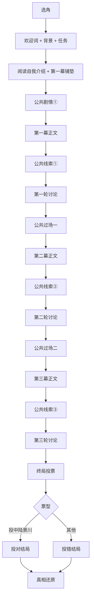

# 《雨夜归零》剧本说明

> 现代言情 · 轻推理 · 3–4 人 · 约 18–22 分钟  
> 本文档供 **主持人 / 开发 / 改稿** 速览全流程、角色与公共线索；玩家手札以各 `角色-*.md` 为准。

---

## 目录

| 章节 | 内容 |
|------|------|
| [一、作品概览](#一作品概览) | 人数、时长、题材 |
| [二、故事背景](#二故事背景) | 晚宴前公共前提 |
| [三、玩家目标](#三玩家目标) | 投票任务（不剧透真凶） |
| [四、标准流程](#四标准流程) | 全流程图 + 步骤表 |
| [五、角色简介](#五角色简介) | 可玩角色与 NPC |
| [六、公共剧情与过场](#六公共剧情与过场) | 三幕衔接要点 |
| [七、公共线索](#七公共线索) | 线索①②③全文 |
| [八、讨论与终局](#八讨论与终局) | 三轮讨论 + 投票 |
| [九、配套文件](#九配套文件) | 仓库文件索引 |
| [十、创作规范](#十创作规范) | 互见、称呼、字数 |
| [附录 · 配音声线](#附录配音声线) | TTS / AI 提示词 |

---

## 一、作品概览

| 项目 | 内容 |
|------|------|
| **题材** | 现代言情 · 轻推理 |
| **人数** | 3–4 人（建议 4 人；3 人局由 DM 代述程予安相关公开信息） |
| **时长** | 约 18–22 分钟 |
| **结构** | 3 幕私密剧本 + 3 轮讨论 + 终局投票 + 结局 + 真相还原 |
| **场景** | 滨海「玻璃湾七号」私宅，暴雨夜 |
| **正确答案** | **陆景川**（仅 DM / App 判定，勿提前告知玩家） |

**扮演要点**：真凶玩家开局亦不知自己是凶手；随幕推进在私密本中逐步恢复记忆。各角色互不知晓他人秘密（恋情、匿名信、取信等），发言只基于「当时以为」的表象。

---

## 二、故事背景

**时间**：2025 年 11 月 7 日（周五）傍晚至翌晨。  
**地点**：滨海新城悬崖私宅「玻璃湾七号」。

归零科技完成 B 轮后，须签署「对赌延期补充协议」——**周一上午 10:00**，资方沈厚泽与创始人林晚星须共同到场。林晚星以私人名义邀请四人聚餐，对外称庆功，对内是签字前最后一夜。

**到场四人（玩家）**：苏晚晴、陆景川、沈知意、程予安。  
**东道主**：林晚星（女，非玩家，当晚中毒送医）。

**全员可知的前提**（晚宴开始前）：

- 林晚星对**金盏花**过敏（细节仅核心圈知晓，未向一般宾客公开）。
- 暴雨；主楼餐厅与负一层酒窖、负二层车库连通。
- 保安队长周启驻场。

> 此时尚未发生中毒。完整主持词与公共剧情正文见 `DM-主持剧本.md`。

---

## 三、玩家目标

> **在全部剧情与三轮讨论结束后，投票选出你认为导致林晚星中毒的人。**

- 开场**不公布**真凶姓名。
- 讨论前由 DM 宣读当轮**公共线索**；线索之外靠推理与质问补全空白。
- 本局**无席间公开发言环节**；玩家在手札内阅读「自我介绍」与各幕正文即可。

---

## 四、标准流程

### 流程总览

### 步骤明细

| 步骤 | 玩家 | DM |
|:----:|------|-----|
| 1 | 自主选角 | 宣读欢迎词、故事背景、投票任务 |
| 2 | 阅读「自我介绍」（第二人称，晚宴出发前） | — |
| 3 | — | 宣读 **公共剧情①**（至客厅沙发、收走手机） |
| 4 | 阅读 **第一幕**（从沙发回溯今夜） | — |
| 5 | — | 宣读 **公共线索①** |
| 6 | **第一轮讨论**（参考第一幕末【本幕任务】） | 宣读讨论任务 |
| 7 | — | 宣读 **公共过场一**（22:00 还手机、监控） |
| 8 | 阅读 **第二幕**（接过场尾部） | — |
| 9 | — | 宣读 **公共线索②** |
| 10 | **第二轮讨论** | 宣读讨论任务 |
| 11 | — | 宣读 **公共过场二**（翌晨医院来电、律师到门） |
| 12 | 阅读 **第三幕** | — |
| 13 | — | 宣读 **公共线索③** |
| 14 | **第三轮讨论** → **投票** | 统计票型 |
| 15 | — | 宣读 **投对 / 投错结局** → **真相还原** |

**阅读顺序提示**：步骤 2 与 3 的关系为——先读自我介绍，**听完公共剧情①后再读第一幕**（第一幕现时点 = 20:25 客厅沙发）。

---

## 五、角色简介

### 速览表

| 角色 | 性别 | 可玩 | 对外身份 | 与林晚星 / 当晚关系 |
|------|:----:|:----:|----------|---------------------|
| **林晚星** | 女 | 否 | 创始人 | 东道主，中毒受害者 |
| **苏晚晴** | 女 | 是 | 品牌总监 | 分手两年的前任，刚调回滨海 |
| **陆景川** | 男 | 是 | 联合创始人 / CTO | 创业搭档（真凶，渐进认知） |
| **沈知意** | 女 | 是 | 沈厚泽基金代表 | 资方审计与签字代表 |
| **程予安** | 男 | 是 | 总裁助理 | 跟了林晚星四年，后勤与机要 |
| **周启** | 男 | 否 | 保安队长 | DM 代读，现场控场 |

**第三人称**：林晚星、苏晚晴、沈知意用「她」；陆景川、程予安用「他」。剧情叙述用**全名**，酒窖角标写作「陆景川贺酒」。

---

### 林晚星（东道主 · 非玩家）

| 项 | 内容 |
|----|------|
| **年龄感** | 29–32 |
| **人设** | 玻璃湾七号女主人；庆功夜控场，笑浅而稳；对合伙人温柔一句，对条款不卑不亢。 |
| **当晚** | 坚持选用「陆景川贺酒」香槟；**先饮一口**后敬全桌；中毒送医。 |
| **玩家须知** | 仅出现在公共剧情、线索与他人回忆中；无独立手札。 |

---

### 苏晚晴（玩家）

| 项 | 内容 |
|----|------|
| **年龄感** | 27–29 |
| **人设** | 「会讲故事的人」——品牌总监；骄傲、克制，不讨好林晚星。 |
| **与林晚星** | 前任；曾写匿名提醒信（**秘密**，勿主动公开）。 |
| **当晚要点** | 19:45 离席洗手间；19:48 门外听见酒窖对话；19:52 回席见贺酒瓶；**不是凶手**。 |
| **手札文件** | `角色-苏晚晴.md` |

---

### 陆景川（玩家 · 真凶）

| 项 | 内容 |
|----|------|
| **年龄感** | 30–32 |
| **人设** | 技术合伙人，话少背直；压力下更冷更硬，短句推责。 |
| **秘密** | 与沈知意恋情（勿主动公开）；API 接口费窟窿；未登记副卡下毒。 |
| **认知弧线** | 第一幕以为清白 → 第二幕动摇 → 第三幕私密里明白，**对外仍宜脱罪**。 |
| **当晚要点** | 19:40 阳台；19:43 前后负二层下毒（记忆空白）；19:48 **留在餐厅席**不在酒窖。 |
| **手札文件** | `角色-陆景川.md` |

---

### 沈知意（玩家）

| 项 | 内容 |
|----|------|
| **年龄感** | 25–27 |
| **人设** | 资方代表；宣读条款时声线温柔、字字冷；父亲「别让我失望」压在身上。 |
| **秘密** | 恋陆景川（**秘密**）；19:45 收微信「别动那一支」。 |
| **当晚要点** | **全程在席**（服务员可证）；第二幕可质问陆景川搜索记录；**不是凶手**。 |
| **手札文件** | `角色-沈知意.md` |

---

### 程予安（玩家）

| 项 | 内容 |
|----|------|
| **年龄感** | 26–28 |
| **人设** | 沉默影子；忠诚、机要；工牌主卡可开酒窖门禁。 |
| **秘密** | 暗恋林晚星；19:41 取苏晚晴旧信销毁（**秘密**）。 |
| **当晚要点** | 19:41 通风间取信未碰香槟；19:48 随林晚星取酒并提醒未登记；第三幕可出示瓶底码。 |
| **手札文件** | `角色-程予安.md` |

---

### 周启（保安队长 · DM）

现场负责人：收手机、封存物证、宣读线索、协调律师与医院信息。语气克制权威，不煽情。

---

## 六、公共剧情与过场

DM 宣读正文（各约六百字）见 `DM-主持剧本.md`。下表为**段末「此刻」**，各角色下一幕开篇须与此一致。

| 段落 | 宣读时机 | 段末场景（「此刻」） | 玩家接着阅读 |
|------|----------|----------------------|--------------|
| **公共剧情①** | 第一幕前 | **20:25** 客厅沙发，周启收走手机，问 19:45–20:00 在哪 | **第一幕** |
| **公共过场一** | 第二幕前 | **22:00** 手机刚还，平板监控，周启上楼，碎纸机响 | **第二幕** |
| **公共过场二** | 第三幕前 | **清晨** 沙发茶几旁，刚听完 **07:12** 医院免提，律师门外 | **第三幕** |

### 第一幕时间轴（公共事实摘要）

| 时刻 | 事件 |
|------|------|
| 19:30 | 晚宴开席，林晚星举杯 |
| 19:40 | 陆景川去阳台 |
| 19:45 | 苏晚晴离席；陆景川发微信给沈知意 |
| 19:48 | 林晚星 + 程予安下酒窖（**仅此二人在酒窖内**） |
| 19:52 | 捧「陆景川贺酒」回席 |
| 19:55 | 林晚星先饮，再敬全桌 |
| 20:03 | 林晚星中毒 |
| 20:25 | 四人客厅沙发，收手机 |

### 互见修订

同一时刻若 A 看见 B，B 本须有对应感知。详表见 **`00-交叉场景对照表.md`**。

---

## 七、公共线索

> 每轮讨论**开始前**由 DM 宣读。玩家可隐瞒隐私，**不得编造与已公开线索冲突的物证**。

---

### 公共线索① · 第一幕后

**讨论方向**：对质时间线、解释离席、提出怀疑。

| # | 线索名称 | 要点 |
|---|----------|------|
| 1 | **酒窖门禁刷卡记录** | 19:42 程予安主卡开酒窖门；19:48 前后第二次；**19:43 未登记副卡刷卡失败** |
| 2 | **C-2 空香槟瓶** | 法国小众款，常备单无此款；瓶口检出**金盏花粉**，与林晚星血检一致 |
| 3 | **服务员书面证词** | 19:48–19:52 仅林晚星、程予安进酒窖；19:45–19:50 陆景川位空、苏晚晴去洗手间、**沈知意未离席** |
| 4 | **过敏档案摘录** | 林晚星对金盏花过敏；知情范围为核心圈，未向一般宾客公开 |

**3 人局（缺程予安）**：DM 代述——「随林晚星取酒时，C-2 有未登记进口酒，林晚星坚持选用。」

---

### 公共线索② · 第二幕后

**讨论方向**：监控缺口、指纹、搜索记录交锋。

| # | 线索名称 | 要点 |
|---|----------|------|
| 1 | **物业监控（19:30–20:15）** | 餐厅通道完整；酒窖门口 **19:40–19:46 空白 30 秒**（物业盲区，非人为删）；负二层 **19:44–19:47** 深色西装背影，袖口水渍 |
| 2 | **负二层乳胶手套** | 内侧金盏花粉；外侧指纹与**陆景川部分吻合** |
| 3 | **程予安当面陈述** | 19:41 开通风间小门取私人信件，未碰香槟；信封可验 |
| 4 | **陆景川手机搜索记录** | **19:46** 已删词条恢复：「金盏花粉 过敏性休克 **剂量**」 |

---

### 公共线索③ · 第三幕后 · 投票前

**讨论方向**：整理动机与时间线，准备投票。

| # | 线索名称 | 要点 |
|---|----------|------|
| 1 | **瓶底隐形码（扫码）** | 境外代购；收货尾号 **7031**（绑定陆景川备用支付宝）；备注「派对用香槟」 |
| 2 | **沈厚泽实验室传真** | 花粉为**人工浓缩添加**；周一 10:00 须沈厚泽到场签字，否则协议作废 |
| 3 | **陆景川车后座香槟** | 同批次**未开封**一瓶，**未**检出花粉 |
| 4 | **书房打印图（可选）** | 邮件「庆功宴酒水单」删了又恢复，指向陆景川旧机；**仅当苏晚晴玩家主动交出时**才向全场出示 |

---

## 八、讨论与终局

| 轮次 | 对应幕 | 玩家参考 | DM 宣读 |
|------|--------|----------|---------|
| 第一轮 | 第一幕后 | 各角色本【本幕任务】 | 线索① + 讨论任务 |
| 第二轮 | 第二幕后 | 各角色本【本幕任务】 | 线索② + 讨论任务 |
| 第三轮 | 第三幕后 | 各角色本【本幕任务】 | 线索③ + 讨论任务 |

### 终局投票

- 每人一票，投认为的下毒者（弃权按现场规则处理）。
- **投对**：**陆景川** 得票**唯一最多** → 宣读「投对结局」。
- **投错**：其他结果 → 宣读「投错结局」。
- 随后 DM 宣读 **真相还原**（约 1200 字，讲述体）。

结局与还原全文见 `DM-主持剧本.md`。

---

## 九、配套文件

| 文件 | 用途 |
|------|------|
| `00-剧本说明.md` | 本说明（流程 / 角色 / 线索） |
| `00-交叉场景对照表.md` | 同一时刻四角色互见核对 |
| `DM-主持剧本.md` | 主持全文：欢迎词、公共剧情、过场、线索、结局、真相 |
| `角色-苏晚晴.md` | 玩家手札 |
| `角色-陆景川.md` | 玩家手札（真凶） |
| `角色-沈知意.md` | 玩家手札 |
| `角色-程予安.md` | 玩家手札 |
| `第一幕公共剧情/`、`第二幕公共剧情/` | 语音资源（App 用） |
| `真相还原-立绘提示词.md` | 角色立绘：中文说明 + 英文可复制提示词，纯白底半身/全身 |
| `真相还原-AI视频分镜.md` | 事件真相叙事短片：13 镜 I2V 讲清整夜发生了什么（非剧本流程） |

---

## 十、创作规范

| 规范 | 说明 |
|------|------|
| **互见** | 修订角色本必查 `00-交叉场景对照表.md` |
| **开篇衔接** | 公共剧情 / 过场段末 = 下一幕「现时点」 |
| **酒窖 19:48** | 仅林晚星 + 程予安在内；陆景川在餐厅席 |
| **发言** | 只给【本幕任务】方向，不写示范台词 |
| **字数** | 角色自我介绍约 1000 字；每幕正文约 1000 字；DM 公共段各约 600 字 |

### 字数速查

| 类型 | 汉字约 |
|------|--------|
| 角色自我介绍 | 1000 |
| 角色每一幕正文 | 1000 |
| 角色合计（介绍 + 三幕） | 4000 |
| DM 公共剧情 / 过场 | 各 600 |
| DM 投对 / 投错结局 | 各 1000 |
| DM 真相还原 | 1200 |

---

## 附录 · 配音声线

> 供 TTS、AI 配音、声线选角。情绪弧线：**第一幕**克制社交 → **中毒**紧张 → **第二幕**对峙 → **第三幕**疲惫锋利。

### 音色标签速查

| 角色 | 可玩 | 年龄感 | 气场关键词 | 音色标签（中文） |
|------|:----:|--------|------------|------------------|
| 林晚星 | 否 | 29–32 | 控场、先饮后敬 | 御姐音、成熟女王音 |
| 苏晚晴 | 是 | 27–29 | 前任克制、疏离 | 少御音、清冷知性御姐 |
| 陆景川 | 是 | 30–32 | 话少、压力下更硬 | 青年低沉男声、禁欲系低音 |
| 沈知意 | 是 | 25–27 | 条款即刀、温柔外壳 | 少御音、温柔冷感少女音 |
| 程予安 | 是 | 26–28 | 沉默影子、忠诚 | 青年干净男声、温和男中音 |
| 周启 | 否 | 38–45 | 权威克制 | 成熟男中低音、刑侦旁白感 |
| DM 旁白 | — | — | 雨夜沉浸、不剧透 | 叙述男中音、纪录片质感 |

**混音建议**：三女声拉开音高——林晚星最低沉，苏晚晴最冷疏，沈知意最清亮；陆景川短句更硬，程予安更轻更短。

各角色完整可复制提示词（含【禁止】项）仍保留在改稿备份中；App 接入时可从各 `角色-*.md` 人设段落与上表组合生成。

---

*修订剧本时请同步更新本说明与 `00-交叉场景对照表.md`、`DM-主持剧本.md`。*
